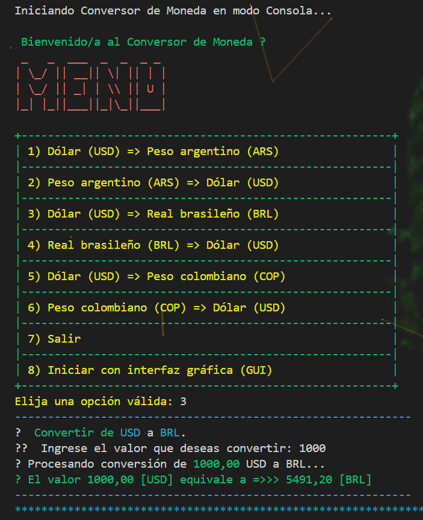
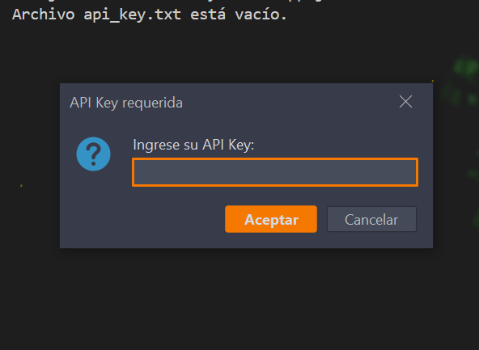
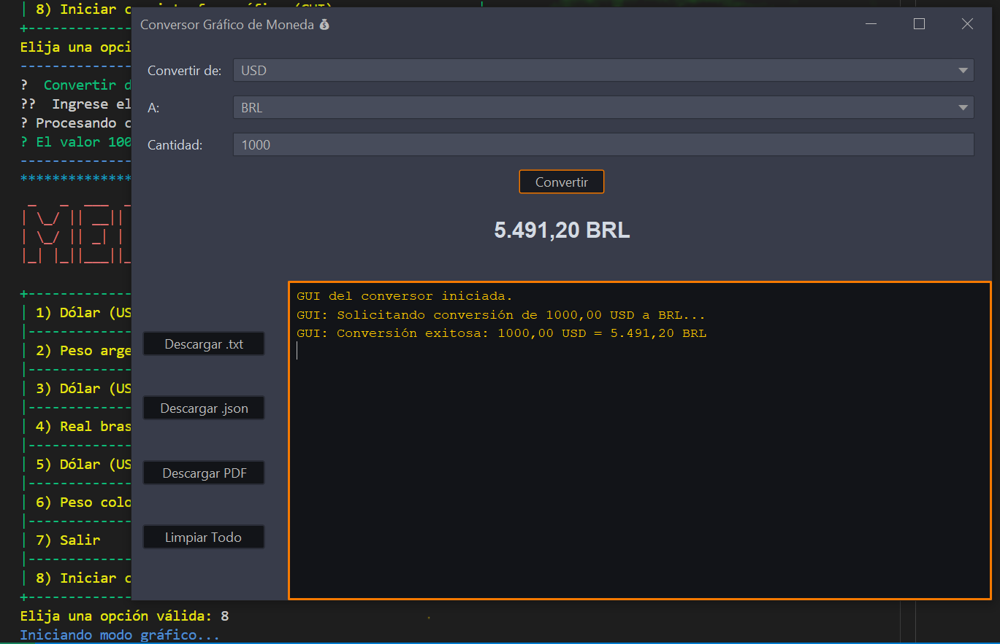
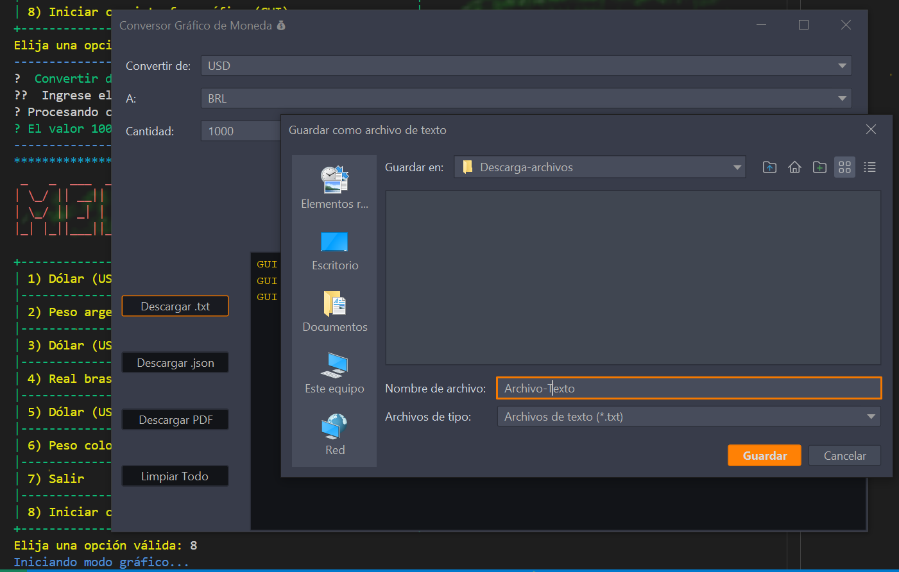
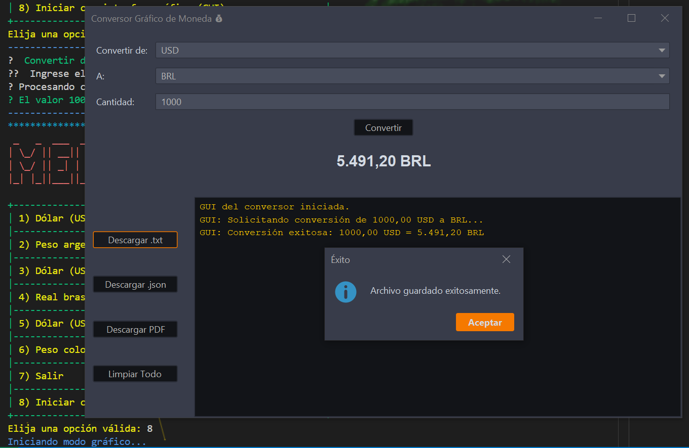
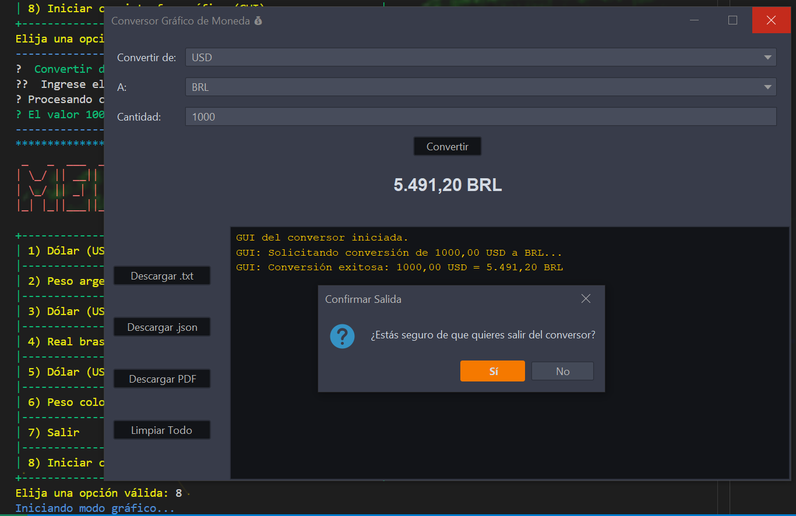

# 💱 ManyConversor

**ManyConversor** es una aplicación Java para la conversión de divisas en tiempo real. Permite operar tanto en **modo consola** como en una moderna **interfaz gráfica (GUI)**, utilizando una API externa para obtener tasas de cambio actualizadas.

Desarrollado como parte del desafío práctico del programa **Oracle Next Education 2025 – Back-End Java**.

---

## 🧭 Características principales

- Conversión de monedas entre:
  - Dólar estadounidense (USD) ↔ Peso argentino (ARS)
  - USD ↔ Real brasileño (BRL)
  - USD ↔ Peso colombiano (COP)
- Modo consola interactivo con colores y diseño llamativo
- Interfaz gráfica intuitiva con:
  - ComboBox para elegir monedas
  - Campo de entrada de cantidad
  - Resultado visual 
  - Consola integrada para mensajes
  - Botones de descarga: `.txt`, `.json`, `.pdf`
  - Botón "Limpiar Todo"
- Compatible con coma o punto como separador decimal
- Entrada de API Key por archivo o por ventana emergente

---

## 🔐 API Key (requerida para funcionar)

La aplicación utiliza una API externa **Exchangerate-api** para obtener las cotizaciones de divisas. Para su uso completo, **se requiere una clave de acceso (API Key)**.

### 📥 Cómo usar la API Key

1. **Crea el archivo:**  
   `src/main/resources/api_key.txt`

2. **Coloca tu clave en una sola línea:**  
   Ejemplo:
   xxxxxxxxxxxxxxxxxxxxxxxx

3. **¿Y si no coloco la clave?**  
- La app seguirá funcionando, pero no podrá obtener conversiones reales.
- La GUI se abrirá, pero los controles de conversión estarán deshabilitados.
- Se mostrará un mensaje de advertencia.
- La app intentará pedir la clave por una ventana emergente y guardarla automáticamente en el archivo.
- Si a clave es correcta la app funcionara normalmente con todas sus funcionalidades.

---

## 🖥️ Modo consola

### ▶️ Ejecutar el JAR

Por consola:

```
java -jar manyconversor.jar
```
O doble clic en:

manyconversor.jar

## 📋 Menú de opciones
Opciones 1 a 6: Conversiones de moneda

Opción 7: Salir

Opción 8: Iniciar la GUI

La consola tiene colores ANSI, estilos ASCII y validaciones para una experiencia interactiva.

## 🖼️ Modo gráfico (GUI)
También podés iniciar la aplicación en modo gráfico desde la consola (opción 8) o directamente desde código.

## ✨ Características de la GUI
Conversión rápida entre monedas

Feedback inmediato en pantalla

Consola integrada con mensajes de la app

Botones de descarga:

### 📄 Exportar a .txt

### 🧾 Exportar a .json

### 📕 Exportar a .pdf

### Botón 🧹 "Limpiar Todo" para reiniciar los campos

⚠️ Si la API Key no está disponible, los campos y botones de conversión estarán deshabilitados.

## 📸 Capturas de pantalla

### 🖼️ Interfaz consola:



### Ingrese su API KEY:



### 🖼️ Interfaz gráfica (GUI)



### Descargar archivos en varios formatos:



### Confirmar la descarga:



### Cerrar APP:



## 🛠️ Tecnologías utilizadas
Java 21+

Swing (para la GUI)

API REST para tipo de cambio (como exchangerate-api o similar)

JSON simple o GSON para exportaciones

PDFBox o similar para exportar PDF (si se usa)

## 📜 Licencia
Este proyecto es de uso educativo y fue desarrollado por Christian Gonzalo como parte del curso Oracle Next Education 2025.
Podés usarlo, modificarlo y compartirlo citando al autor. 🙌
